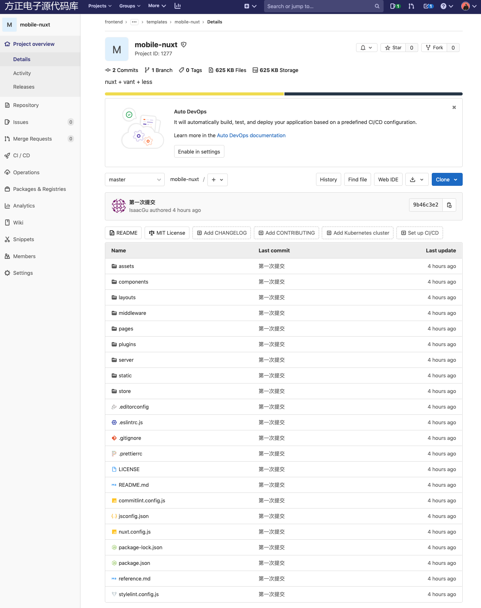

## 手写一个规范流程化的脚手架

> 对于一些流程化的，没有任何技术含量的工作，能不能交由计算机来完成呢？我们只是输入少量的变量就可以完成相关的工作呢？通常而言，我们第一个想到的就是使用 `shell` 这样的脚本，但我们可以使用 `node` 做得更多且更好。本节我们将通过实现一个 `前端脚手架` 来示例如何使用 `node` 来处理流程化的工作。

## TL;DR

在前端工程中，我们希望通过使用最新的语法（js和css）和各类代码检查工具来提升开发效率。同时，我们也希望把一些积累下来的最佳实践、通用方法、部署配置、性能优化等等方案继承下来。 

最先想到的就是在 `gitlab` 上创建一个**最佳实践**的示例工程，定期有人维护、更新最新的各类插件。当我们新开一个项目的时候，只需开发人员下载工程，并且修改`些许`配置就可以应用了。但是这 `些许` 配置就有可能因为各种原因而浪费无尽的时间，例如 配置文档写得不清楚、文档更新不及时、开发人员没有相关配置经验等等。

因此，我们期待一个**示例工程**以及一个**自动**生成工程的脚手架，使得我们通过多个**下一步**正确无误地创建工程。

以下我们会从几个方面来讲解如何实现一个前端脚手架。

- 前言
- 工程中引用的第三方库 - 通常而言，当我们了解了工程中所引用的第三方库，就可以大致了解
- 实现思路
- 分步实现
  - 思路
  - steps
  - 测试
- 演示

## 思路

### 流程

1. 用 commander 创建命令也就是明确这个脚手架都有哪些主要功能
2. 使用 inquirer 获得用户输入的值
3. 下载 文件
4. 修改文件中的文档
5. done

commander 命令编写
chalk 让输出带颜色
download-git-repo 下载git模板
inquirer 命令行交互，获取用户输入
ora 进度条
fs-extra 文件相关操作工具库
mem-fs 操作模板文件工具库
mem-fs-editor 操作模板文件工具库

流程

## 分步实现

### 准备阶段

#### 在命令行中输入 fcli 后，直接执行 `src/bin.js` 中的方法

#### 使用 commander 定义指令

## 推荐文档

- https://juejin.cn/post/6890808608503267341
- https://juejin.cn/post/6874815221174075405
- https://github.com/LuckyWinty/create-repo-cli/blob/master/index.js
- https://github.com/Li13/my-cli/tree/master/cli-create

- Commander.js 中文文档(cli必备)： https://segmentfault.com/a/1190000019350684
