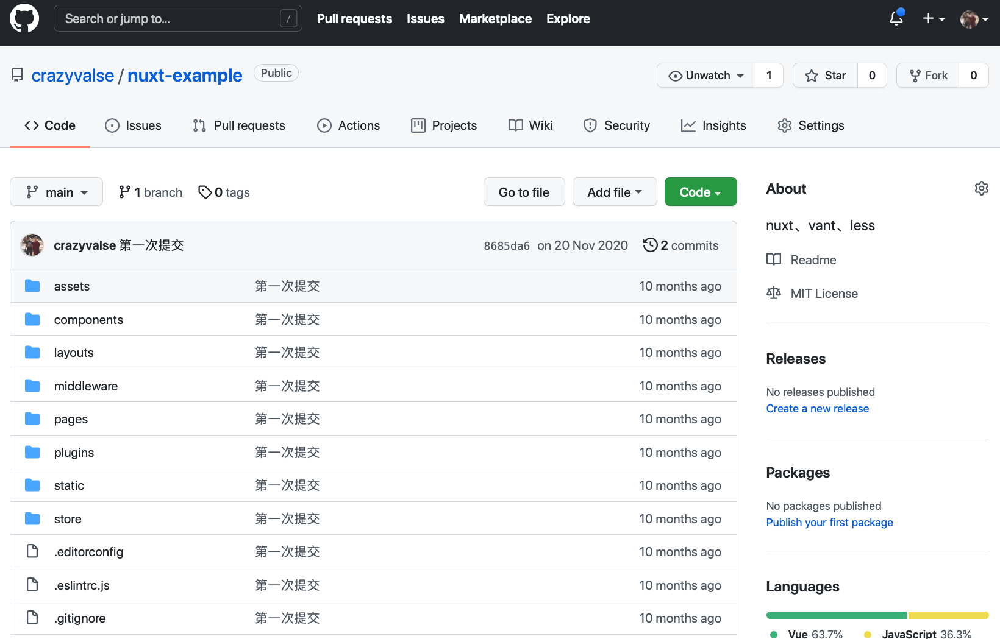

## 手写一个规范流程化的脚手架

> 对于一些流程化的，没有任何技术含量的工作，能不能交由计算机来完成呢？我们能不能只输入少量的变量就可以完成相关的工作呢？通常而言，我们第一个想到的就是使用 `shell` 这样的脚本，但我们可以使用 `node` 做得更多且更好。本节我们将通过实现一个 `前端脚手架` 来示例如何使用 `node` 来处理流程化的工作。

## TL;DR

在前端工程中，我们希望通过使用最新的语法（js和css）和各类代码检查工具来提升开发效率。同时，我们也希望把一些积累下来的最佳实践、通用方法、部署配置、性能优化等等方案继承下来。我们更希望能够把这些东西应用到新的工程当中。

最先想到的办法就是在 `gitlab` 上创建一个**最佳实践**的示例工程，定期有人维护、更新最新的各类插件。当我们新开一个项目的时候，只需开发人员下载工程，并且修改`少量`配置就可以应用了。但是这 `少量` 配置就有可能因为各种原因而浪费无尽的时间，例如 配置文档写得不清楚、文档更新不及时、开发人员没有相关配置经验等等。



因此，我们期待一个**示例工程**以及一个**自动**生成工程的脚手架，使得我们能够通过多个**下一步**正确无误地创建工程。


以下我们会从几个方面来讲解如何实现一个前端脚手架。

<!-- START doctoc generated TOC please keep comment here to allow auto update -->
<!-- DON'T EDIT THIS SECTION, INSTEAD RE-RUN doctoc TO UPDATE -->


- [思路](#%E6%80%9D%E8%B7%AF)
  - [总体思路：](#%E6%80%BB%E4%BD%93%E6%80%9D%E8%B7%AF)
  - [具体实现思路](#%E5%85%B7%E4%BD%93%E5%AE%9E%E7%8E%B0%E6%80%9D%E8%B7%AF)
- [分步实现](#%E5%88%86%E6%AD%A5%E5%AE%9E%E7%8E%B0)
  - [1. 注册命令](#1-%E6%B3%A8%E5%86%8C%E5%91%BD%E4%BB%A4)
    - [1.1: 初始化工程](#11-%E5%88%9D%E5%A7%8B%E5%8C%96%E5%B7%A5%E7%A8%8B)
    - [1.2: 创建 `src/bin.js` 文件](#12-%E5%88%9B%E5%BB%BA-srcbinjs-%E6%96%87%E4%BB%B6)
    - [1.3: 调整 `package.json`](#13-%E8%B0%83%E6%95%B4-packagejson)
    - [1.4: 运行 `npm link`](#14-%E8%BF%90%E8%A1%8C-npm-link)
    - [1.5 测试](#15-%E6%B5%8B%E8%AF%95)
    - [示例工程](#%E7%A4%BA%E4%BE%8B%E5%B7%A5%E7%A8%8B)
  - [2. 解析命令](#2-%E8%A7%A3%E6%9E%90%E5%91%BD%E4%BB%A4)
    - [2.1 调整 `src/bin.js`](#21-%E8%B0%83%E6%95%B4-srcbinjs)
    - [2.2 测试](#22-%E6%B5%8B%E8%AF%95)
    - [示例工程](#%E7%A4%BA%E4%BE%8B%E5%B7%A5%E7%A8%8B-1)
  - [3 获得用户信息](#3-%E8%8E%B7%E5%BE%97%E7%94%A8%E6%88%B7%E4%BF%A1%E6%81%AF)
    - [3.1 创建 `prompts.js` 文件](#31-%E5%88%9B%E5%BB%BA-promptsjs-%E6%96%87%E4%BB%B6)
    - [3.2 测试](#32-%E6%B5%8B%E8%AF%95)
  - [4. 下载模板工程](#4-%E4%B8%8B%E8%BD%BD%E6%A8%A1%E6%9D%BF%E5%B7%A5%E7%A8%8B)
    - [4.1 准备](#41-%E5%87%86%E5%A4%87)
    - [4.2 创建 `src/download-template.js` 文件](#42-%E5%88%9B%E5%BB%BA-srcdownload-templatejs-%E6%96%87%E4%BB%B6)
    - [测试](#%E6%B5%8B%E8%AF%95)
  - [5. 修改文件](#5-%E4%BF%AE%E6%94%B9%E6%96%87%E4%BB%B6)
    - [5.1 创建 `update-files.js` 文件](#51-%E5%88%9B%E5%BB%BA-update-filesjs-%E6%96%87%E4%BB%B6)
    - [5.2 测试](#52-%E6%B5%8B%E8%AF%95)
  - [6. 安装工程中的依赖](#6-%E5%AE%89%E8%A3%85%E5%B7%A5%E7%A8%8B%E4%B8%AD%E7%9A%84%E4%BE%9D%E8%B5%96)
    - [6.1 创建 `src/install-dependencies.js`](#61-%E5%88%9B%E5%BB%BA-srcinstall-dependenciesjs)
    - [6.2 测试](#62-%E6%B5%8B%E8%AF%95)
  - [7. 调整 `src/bin.js` 文件](#7-%E8%B0%83%E6%95%B4-srcbinjs-%E6%96%87%E4%BB%B6)
  - [8. 完整演示](#8-%E5%AE%8C%E6%95%B4%E6%BC%94%E7%A4%BA)
  - [9. 发布到 npm](#9-%E5%8F%91%E5%B8%83%E5%88%B0-npm)
  - [10. 示例工程](#10-%E7%A4%BA%E4%BE%8B%E5%B7%A5%E7%A8%8B)
- [推荐文档](#%E6%8E%A8%E8%8D%90%E6%96%87%E6%A1%A3)

<!-- END doctoc generated TOC please keep comment here to allow auto update -->


## 思路

### 总体思路：

- 用户在 `terminal` 输入必要信息;
- 脚本自动从 `gitlab` 下载**模板工程**;
- 脚本使用 `用户输入的信息` 修改 **模板工程** 中的文件;


### 具体实现思路

1. 注册命令，并能接收命令行传入的参数 
2. 以**询问**的方式获得用户的输入信息
3. 从 `gitlab` 上获得**模板工程**
4. 改写**模板工程**中的文件
5. 自动下载工程中的依赖

接下来我们将分步实现

## 分步实现

### 1. 注册命令

我们需要使用 `npm link` 命令将我们的**可执行文件(bin)**链接到 `{prefix}/bin/{name}`。换句话说，`npm link` 命令可以让我们在任意位置使用命令行直接运行我们的脚本。

以下就是我们的具体实现步骤：

#### 1.1: 初始化工程

首先初始化一个工程，并在工程中安装 `.editorconfig`、`eslint.js`、`prettier.js` 等插件。详细可以参考 [一个易维护的 webpack 工程](https://github.com/crazyvalse/webpack-tutorial) 。

示例工程： [examples/01](./examples/01)

#### 1.2: 创建 `src/bin.js` 文件

在第一行中，`#!` 是一个约定的标记，它告诉系统这个脚本需要什么解释器来执行，即使用哪一种 Shell。`#!/usr/bin/env node` 这句话让系统动态的去 PATH 目录中查找 node 来执行你的脚本文件。

[src/bin.js](./examples/01/src/bin.js)

```js
#!/usr/bin/env node

// 获得参数
console.info(process.argv)
```

#### 1.3: 调整 `package.json`

在 `package.json` 中，添加 `bin` 属性

```json
{
  "bin": {
    "lcli": "src/bin.js"
  }
}
```

#### 1.4: 运行 `npm link`

在工程根目录下执行命令

```bash
npm link
```

执行完脚本后，`terminal` 中显示了链接信息：

```
...

/usr/local/bin/scli -> /usr/local/lib/node_modules/00/src/bin.js
/usr/local/lib/node_modules/00 -> /Users/CodingNutsZac/Documents/git/write-a-cli/examples/01
```

#### 1.5 测试

打开 `terminal` 输入 `lcli`，可以获得以下结果：


#### 示例工程

示例工程： [examples/01](./examples/01)

---

### 2. 解析命令


我们通过 `console` 可以知道，从 `argv`数组第三个元素开始就是我们输入的参数信息，我们可以通过 `switch` 或者 `if else` 来解析参数，也可以使用更好的库 [commander.js](https://github.com/tj/commander.js/blob/master/Readme_zh-CN.md#%e5%91%bd%e4%bb%a4)

[commander.js](https://github.com/tj/commander.js/blob/master/Readme_zh-CN.md#%e5%91%bd%e4%bb%a4) 是一个轻巧的 nodejs 库，提供了用户命令行输入和参数解析强大功能。`commander.js` 是从 `Ruby`同名项目移植过来的。详细内容可以参考 [commander.js 文档](https://github.com/tj/commander.js/blob/master/Readme_zh-CN.md#%e5%91%bd%e4%bb%a4)

#### 2.1 调整 `src/bin.js`

[src/bin.js](./examples/01/src/bin.js)

```js
#!/usr/bin/env node

const { program } = require('commander')
const version = require('../package.json').version

program.version(version, '-v, --version')

program
  .usage('<command> [options]') // 用户使用提示
  .command('create') // 如果没有action 会在同目录下找x-init文件执行
  .description('创建一个工程')
  .action(async () => {
    console.info('----done----')
  })

program.parseAsync(process.argv)
```

#### 2.2 测试

在 `terminal` 中输入

```bash
fcli

fcli create
```

查看结果：


#### 示例工程

示例工程： [examples/02](./examples/02)

### 3 获得用户信息

#### 3.1 创建 `prompts.js` 文件

我们使用 [inquirer](https://github.com/SBoudrias/Inquirer.js#readme) 来帮助我们以问询的方式获得用户输入的信息。

我们设置项目名称、版本号、描述信息、模板、包管理工具等问题，获得一个 `JSON` 格式的结果。


[src/prompts.js](./examples/000/src/prompts.js)

```js
const fse = require('fs-extra')
const inquirer = require('inquirer')
const cwd = process.cwd()

const templates = require('../config/default.json').templates
const choices = Object.keys(templates).map((type) => ({
  name: type,
  value: type
}))

// 设置交互问题
const projectNameQuestion = {
  type: 'input',
  message: `请输入项目名称（英文）：`,
  name: 'name',
  validate: function (name) {
    if (!/^[a-zA-Z_][\w_\-]+$/g.test(name)) {
      return '请输入正确的项目名称！'
    }
    if (fse.existsSync(`${cwd}/${name}`)) {
      return '该文件夹已存在！'
    }
    return true
  }
}

const versionQuestion = {
  type: 'input',
  message: `Version: `,
  name: 'version',
  default: '0.1.0',
  validate: function (val) {
    if (/^((\d){1,3}\.(\d){1,3}\.(\d){1,3})$/g.test(val)) {
      // 校验位数
      return true
    }
    return '请输入正确的格式[数字.数字.数字]，例如：11.22.33'
  }
}

const descriptionQuestion = {
  type: 'input',
  message: `请输入项目描述: `,
  name: 'description'
}

const templateQuestion = {
  type: 'list',
  message: `请选择要下载的模板: `,
  name: 'template',
  choices: [...choices]
}

const cliQuestion = {
  type: 'list',
  message: `请选择包管理工具(如果是公司的项目，必须使用yarn！): `,
  name: 'cli',
  choices: [
    {
      name: 'yarn',
      value: 'yarn'
    },
    {
      name: 'npm',
      value: 'npm'
    },
    {
      name: 'cnpm',
      value: 'cnpm'
    }
  ]
}

async function getUserInputs() {
  const answers = await inquirer.prompt([
    projectNameQuestion,
    versionQuestion,
    descriptionQuestion,
    templateQuestion,
    cliQuestion
  ])
  return {
    ...answers,
    projectPath: `${cwd}/${answers.name}`
  }
}

module.exports = getUserInputs
```

#### 3.2 测试

为了方便，我们直接在 `src/prompts.js` 最后一行调用 `getUserInputs()` 方法。

```js
// ...

const promise = getUserInputs()
promise.then((answer) => {
  console.info(answer)
})
```

用 `node` 运行 `src/prompts.js` ，查看结果


### 4. 下载模板工程

#### 4.1 准备

我们使用以下插件来提升下载过程中的用户体验：

[download-git-repo](https://www.npmjs.com/package/download-git-repo) : 下载git模板

[chalk](https://www.npmjs.com/package/chalk) : 给客户端输出的文字添加颜色


[ora](https://github.com/sindresorhus/ora#readme) : 显示进度条


[symbols](https://www.npmjs.com/package/log-symbols) : 给log添加图标


#### 4.2 创建 `src/download-template.js` 文件

我们在 `src/download-template.js` 中，主要实现是根据模板的 `git` 地址，使用 `download-git-repo` 库下载模板工程。

> 在 `download-git-repo` 提供的方法中只能使用 `callback` 这种方式，为了避免 `回调地狱`，我们返回一个 `Promise` 对象。

[src/download-template.js](./examples/000/src/download-template.js)

```js
const fse = require('fs-extra')
const downloadTemplate = require('download-git-repo')
const chalk = require('chalk')
const ora = require('ora')
const symbols = require('log-symbols')

// 模板的下载地址
const templateGitUrls = require('../config/default.json').templates

async function downloadTemplates(options) {
  return new Promise((resolve, reject) => {
    // 1. 删除与项目同名的文件夹
    if (fse.existsSync(options.projectPath)) {
      const fse = require('fs-extra')
      fse.removeSync(options.projectPath)
    }
    // 2. 下载模板
    const spinner = ora(`下载 ${options.template} 模板 中...`).start()
    downloadTemplate(
      `direct:${templateGitUrls[options.template].url}`,
      options.name,
      { clone: true },
      (err) => {
        // 失败的话，结束进程
        if (err) {
          spinner.fail()
          console.error(
            symbols.error,
            chalk.red(`${err} \n下载模板失败，可能是网络问题...`)
          )
          reject(err)
          process.exit(1)
        }
        // 成功的话，返回 options
        spinner.succeed('下载成功！')
        resolve(options)
      }
    )
  })
}

module.exports = downloadTemplates

// const name = 'hello-world'
// downloadTemplates({
//   projectPath: process.cwd() + '/' + name,
//   name,
//   template: 'web'
// })
```

#### 测试

我们在最下面一行添加 

```js
// ...

const name = 'hello-world'
downloadTemplates({
  projectPath: process.cwd() + '/' + name,
  name,
  template: 'web'
})
```

用 `node` 运行 `src/download-template.js` ，查看结果


### 5. 修改文件

#### 5.1 创建 `update-files.js` 文件

我们借助于 [fs-extra](https://www.npmjs.com/package/fs-extra)  以 `JSON` 的格式读取 `package.json`，修改完后，再以 `JSON` 的形式保存。

[src/update-files.js](./examples/000/src/update-files.js)

```js
const fse = require('fs-extra')

function updateFiles(options) {
  return new Promise((resolve, reject) => {
    // 更新 package.json
    updatePackageJson(options)
    resolve()
  })
}

function updatePackageJson(options) {
  const packageJson = `${options.projectPath}/package.json`
    // 1. 同步读取json文件
    const json = fse.readJsonSync(packageJson)
    // 2. 修改文件
    json.name = options.name
    json.description = options.description
    json.version = options.version
    // 3. 生成 json 文件
    fse.outputJsonSync(packageJson, json, { spaces: 2 })
}

module.exports = updateFiles
```

#### 5.2 测试

我们在最下面一行添加 

```js
// ...

updateFiles({
  projectPath: process.cwd() + '/' + 'hello-world',
  name: 'hello-world',
  description: 'description',
  version: '1.1.1'
})
```

用 `node` 运行 `src/update-files.js` ，查看结果


### 6. 安装工程中的依赖

#### 6.1 创建 `src/install-dependencies.js`

这一步比较简单，我们借助 [cross-spawn](https://www.npmjs.com/package/cross-spawn) 让我们能够**跨平台**执行 `yarn || npm` 脚本安装工程中的依赖。

[src/install-dependencies.js](./examples/000/src/install-dependencies.js)

```js
const spawn = require('cross-spawn')
const chalk = require('chalk')
const symbols = require('log-symbols')

function install(options) {
  const cwd = options.projectPath || process.cwd()
  console.info(symbols.info, '工程目录：' + cwd)
  return new Promise((resolve, reject) => {
    const command = options.cli || 'npm'
    const args = ['install', '--save', '--save-exact', '--loglevel', 'error']
    // 在下载的目录下执行脚本 yarn || npm 脚本
    const child = spawn(command, args, {
      cwd,
      stdio: ['pipe', process.stdout, process.stderr]
    })

    // 脚本执行完进行回调，返回一个promise
    child.once('close', (code) => {
      if (code !== 0) {
        console.error(symbols.error, chalk.red(`安装依赖失败... 请耗子尾汁...`))
        reject({
          command: `${command} ${args.join(' ')}`
        })
        return
      }
      resolve()
    })
    child.once('error', reject)
  })
}

module.exports = install

```

#### 6.2 测试

我们在最下面一行添加 
 
```js
// ...

install({
  projectPath: process.cwd() + '/' + 'hello-world',
  cli: 'yarn'
})
```

用 `node` 运行 `src/update-files.js` ，查看结果


### 7. 调整 `src/bin.js` 文件

最后，我们在 `src/bin.js` 中引用 2、3、4、5、6 步中的文件完成整个流程。

```js
#!/usr/bin/env node

const { program } = require('commander')
const version = require('../package.json').version
const symbols = require('log-symbols')

// 获得用户的输入内容
const getUserInputs = require('./prompts.js')
const downloadTemplate = require('./download-template')
const updateFilesWithUserInputs = require('./update-files')
const installDependencies = require('./install-dependencies')

program.version(version, '-v, --version')

program
  .usage('<command> [options]') // 用户使用提示
  .command('create') // 如果没有action 会在同目录下找x-init文件执行
  .description('创建一个工程')
  .action(async () => {
    try {
      // 1. 获得用户在 terminal 上输入的数据 options: { ... }
      const options = await getUserInputs()
      // 2. 从 gitlab 上下载代码并保存为一个文件夹
      await downloadTemplate(options)
      // 3. 把 options 中的内容复写到下载的文件中
      await updateFilesWithUserInputs(options)
      // 4. 执行 (yarn||npm) install 命令下载依赖
      await installDependencies(options)
    } catch (e) {
      console.error(symbols.error, e)
    }
  })

program.parseAsync(process.argv)

```

### 8. 完整演示

在 `terminal` 中运行 `fcli` 命令


最终生成的项目文件


### 9. 发布到 npm

为了方便使用，我们可以把写好的脚本发布到 npm 上，推荐几篇文章大家可以参考：

- 第一次发布npm包: https://www.jianshu.com/p/ea64fd01679c
- 发布自己的npm包: https://www.cnblogs.com/cangqinglang/p/11225166.html

### 10. 示例工程

示例工程： [examples/000](./examples/000)

## 推荐文档

- npm link 命令的作用浅析: https://blog.csdn.net/juhaotian/article/details/78672390
