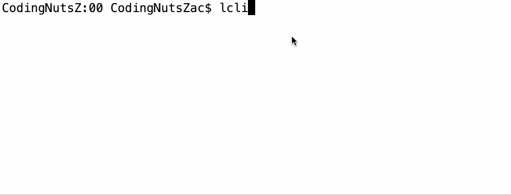

## 准备阶段

- 安装 babel、eslint、prettier、.editorconfig 文件
- `npm link`

##

### step-1 初始化工程

运行以下的命令，初始化工程。

```bash
npm init -y
```

### step-2 安装工具

在项目中安装 `eslint`、`prettier`、`.editorconfig`，详细可以参考 [一个易维护的 webpack 工程](https://git.fzyun.io/frontend/docs/webpack-tutorial)


### step-3 bin

创建 `src/bin.js` 文件，其中，`#!/usr/bin/env node` 是必须得加的，它让系统动态的去 PATH 目录中查找 node 来执行你的脚本文件。

```js
#!/usr/bin/env node

// 获得参数
console.info(process.argv)
```

在 `package.json` 中，添加 `bin` 属性

```json
{
  "bin": {
    "lcli": "src/bin.js"
  }
}
```

然后执行

```bash
npm link
```

#### 测试

在 `terminal` 中输入

```bash
lcli
```

获得以下结果：



从上面的gif示例中我们可以看到，数组从第三个元素开始就是我们在客户端输入的参数了，我们可以使用 `switch` 或者 `if else` 判断输入的这些命令。

也可以有更好的方式。我们可以借助 `commander` 库帮我们解析输入的参数。
